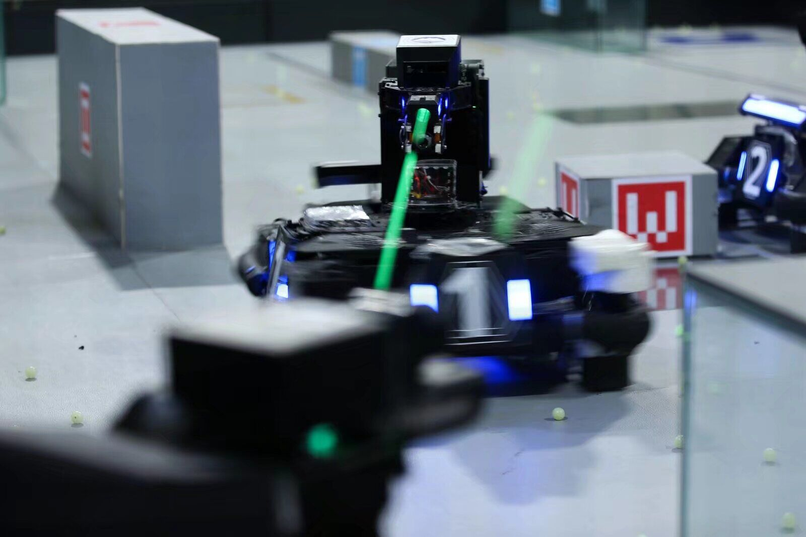

# RMUA2022_东北大学Alkaid战队
 

## 1. 比赛技术方案

[海报](./RMUA2022东北大学摇光战队海报.pdf)

## 2. 比赛现场视频

部分场次比赛视频

[【RMUA2022国际赛】季军争夺赛 东北大学Alkaid VS 哈尔滨工业大学HITCSC 第一场](https://www.bilibili.com/video/BV1pA4y1Z7a7/?spm_id_from=333.999.0.0&vd_source=b86740d9f2b244ac781ad5f60dd8e818)

[【RMUA2022国际赛】季军争夺赛 东北大学Alkaid VS 哈尔滨工业大学HITCSC 第二场](https://www.bilibili.com/video/BV1gZ4y1b7Cy/?spm_id_from=333.999.0.0&vd_source=b86740d9f2b244ac781ad5f60dd8e818)

[【RMUA2022国际赛】淘汰赛八进四 东北大学Alkaid VS 华南农业大学Dream Pioneer第一场](https://www.bilibili.com/video/BV1ar4y1s7Dg/?spm_id_from=333.999.0.0&vd_source=b86740d9f2b244ac781ad5f60dd8e818)

[【RMUA2022国际赛】淘汰赛八进四 东北大学Alkaid VS 华南农业大学Dream Pioneer 第二场](https://www.bilibili.com/video/BV1eA4y1Z7RL/?spm_id_from=333.999.0.0&vd_source=b86740d9f2b244ac781ad5f60dd8e818)

[获奖名单](https://www.robomaster.com/zh-CN/resource/pages/announcement/1454)

## 3. 比赛队员

@https://github.com/niuwengang  

@https://github.com/zhuangzx7  

@https://github.com/lilei-7328  

@https://github.com/Maojiabao  

@https://github.com/QC625  

## 4.部分队伍技术方案

ICRA 2022 Robomaster AI Challenge 八强技术答辩录播 RMUA     [上半场video](https://www.bilibili.com/video/BV1rA4y1d7MD/?spm_id_from=333.337.search-card.all.click&vd_source=b86740d9f2b244ac781ad5f60dd8e818)    [下半场video](https://www.bilibili.com/video/BV1eY4y1V7uC/?spm_id_from=333.999.0.0)

| RMUA2022队伍 | 技术视频 | 技术文档 | 开源代码 |
|:--:|:--:|:--:|----|
| 哈工大深圳-Critical HIT战队 | [video](https://www.bilibili.com/video/BV1w24y1S7ej/?spm_id_from=333.337.search-card.all.click) |      | https://github.com/Critical-HIT-hitsz/RMUA2022 |
| 武汉科技大学-崇实战队 | [video](https://www.bilibili.com/video/BV1nr4y1V7UN/?spm_id_from=333.337.search-card.all.click&vd_source=b86740d9f2b244ac781ad5f60dd8e818) |      |      |
|              |      |      |      |

